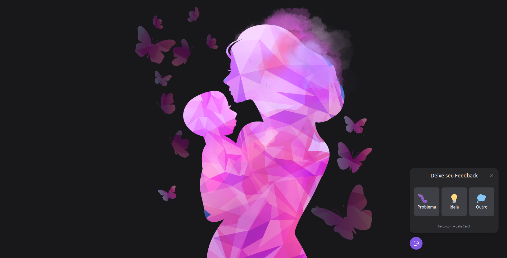
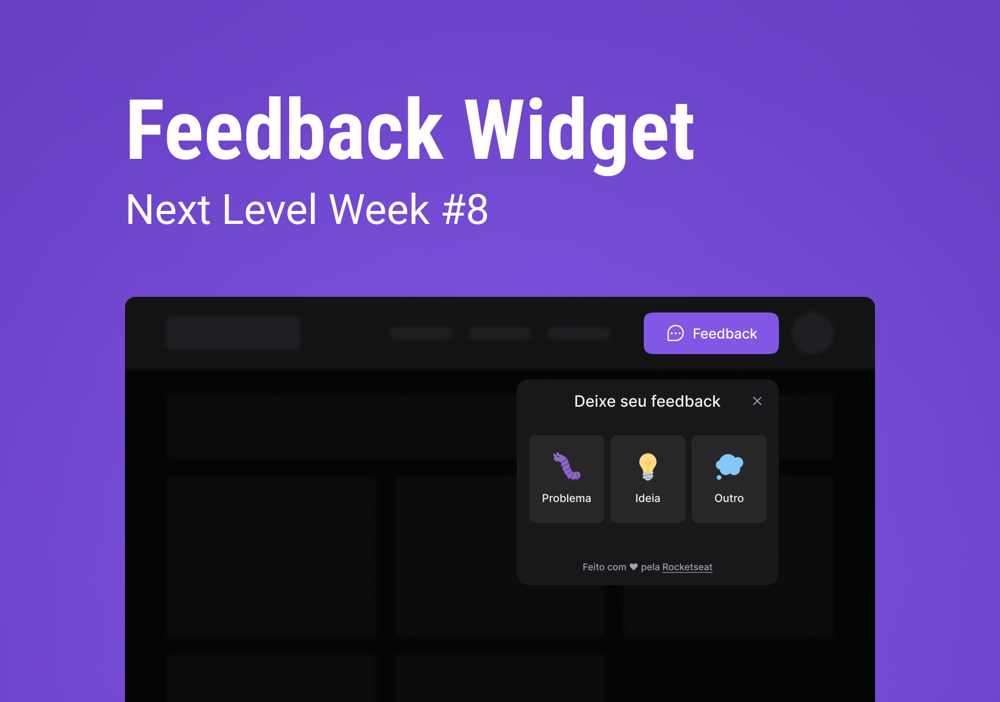

<p align="center">
  
</p>


<p align="center">
  <a href="#rocket-tecnologias">Tecnologias</a>&nbsp;&nbsp;&nbsp;|&nbsp;&nbsp;&nbsp;
  <a href="#-projeto">Projeto</a>&nbsp;&nbsp;&nbsp;|&nbsp;&nbsp;&nbsp;
  <a href="#-layout">Layout</a>&nbsp;&nbsp;&nbsp;|&nbsp;&nbsp;&nbsp;
  <a href="#memo-licença">Licença</a>
</p>

<p align="center">
  
</p>
<br>

## 🚀 Tecnologias

Esse projeto foi desenvolvido utilizando as seguintes tecnologias:

### Frontend Web

- [React](https://pt-br.reactjs.org/)
- [React Native](https://reactnative.dev/)
- [Vite](https://vitejs.dev/)
- [TypeScript](https://www.typescriptlang.org/)
- [Tailwindss](https://tailwindcss.com/)
- [PostCSS](https://postcss.org/)
- [Phosphor](https://phosphoricons.com/)
- [Headlessui](https://headlessui.dev/)
- [Jest](https://jestjs.io/)

### Mobile

- [React Native](https://reactnative.dev/)
- [Expo](https://docs.expo.dev/)
- [TypeScript](https://www.typescriptlang.org/)
- [Phosphor React Native](https://www.npmjs.com/package/phosphor-react-native)

### Backend - API

- [Node.js](https://nodejs.org/en/)
- [TypeScript](https://www.typescriptlang.org/)
- [Prisma](https://www.prisma.io/)
- [Express](http://expressjs.com/)
- [ts-node](https://typestrong.org/ts-node/)
- [Nodemailer](https://nodemailer.com/)
- [Jest](https://jestjs.io/)

## :white_check_mark: Requisitos ##

Antes de iniciar você precisa :checkered_flag:, ter instalado o [Git](https://git-scm.com) e [Node](https://nodejs.org/en/).

## :checkered_flag: Iniciando o projeto ##

```bash
# Clone this project
$ git clone git@github.com:Ca-byte/NLW8_return.git

# Access
$ cd web

# Install dependencies
$ yarn

# Run the project
$ yarn dev

# The server will initialize in the <http://localhost:3000>
```

<!--- ## Notas importantes

- É preciso configurar o backend.
- Altere o arquivo **.env.examplo** para **.env.local** para que o vitejs consiga carregá-lo.
Nota: a variável precisa iniciar com **VITE_**  para ser carregada corretamente (ex.: VITE_EXAMPLE_URL_API).-->


## 💻 Projeto

Feedback Widget: pode ser usado em mais de uma aplicação, com finalidade de colher feedbacks gerais.
(https://nlw-8-return-h5yo70esx-ca-byte.vercel.app/) 

Este é um projeto desenvolvido durante a **[Next Level Week](https://nextlevelweek.com/)**, realizada pela **[@Rocketseat](https://github.com/Rocketseat)** durante os dias 02 a 08 de maio 2022.

## 🔖 Layout

Você pode visualizar o layout do projeto através dos links abaixo:

- [Layout Web](https://www.figma.com/file/bnz7y0xn9YNDky1MYXAY4F/Feedback-Widget-(Community)?node-id=100%3A2114)

Lembrando que você precisa ter uma conta no [Figma](http://figma.com/) para acessá-lo.

## 📝 Licença

Esse projeto está sob a licença MIT. Veja o arquivo [LICENSE](LICENSE.md) para mais detalhes.

---

<p>Desenvolvido com 💜 por Caroline Vieira</p>
